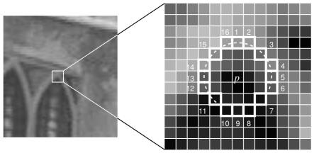

# C++ Circle Detector (CUDA and openMP)

This project implements a fast circle detection algorithm in C++. The  algorithm can be run either on the CPU (with openmp) or GPU (CUDA).

<!-- video src="assets/circle_detector_xbox_720.mp4"></video -->

<figure class="video_container"> <iframe src="assets/circle_detector_xbox_720.mp4" frameborder="0" allowfullscreen="true">  </iframe> </figure>

<!-- <video width="100%" height="auto" controls>
  <source src="assets/circle_detector_xbox_720.mp4" type="video/mp4">
</video> -->

## Overview

The Circle Detector project includes:
- A class for detecting circles in images.
- A CUDA-accelerated implementation for faster processing.
- Adjustable detection parameters for fine-tuning detection performance.

# Algorithm

For each pixel, we examine its neighbors within a specific radius. If the majority of these neighbors are either brighter or darker than the current pixel value, the pixel is marked in the feature map. After all pixels have been analyzed, we search the feature map for clusters of pixels that triggered the detector. If a cluster is sufficiently large, it is added to the list of detected features.

## Requirements
- Windows Visual  Studio
- OpenCV (set OPENCV_DIR variable in environment variables)
- RealSense  (set REALSENSE variable in environment variables)
- CUDA (for GPU acceleration)

 

